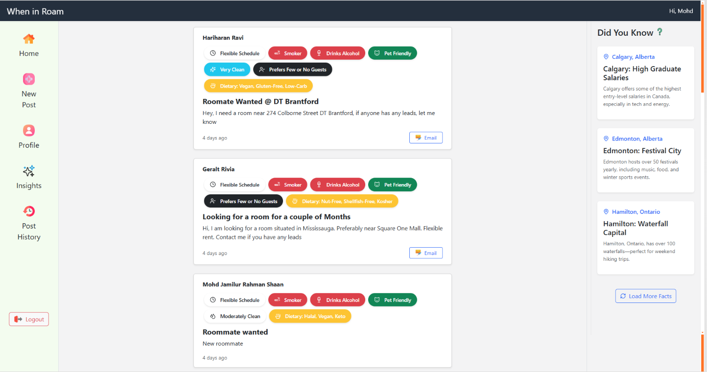
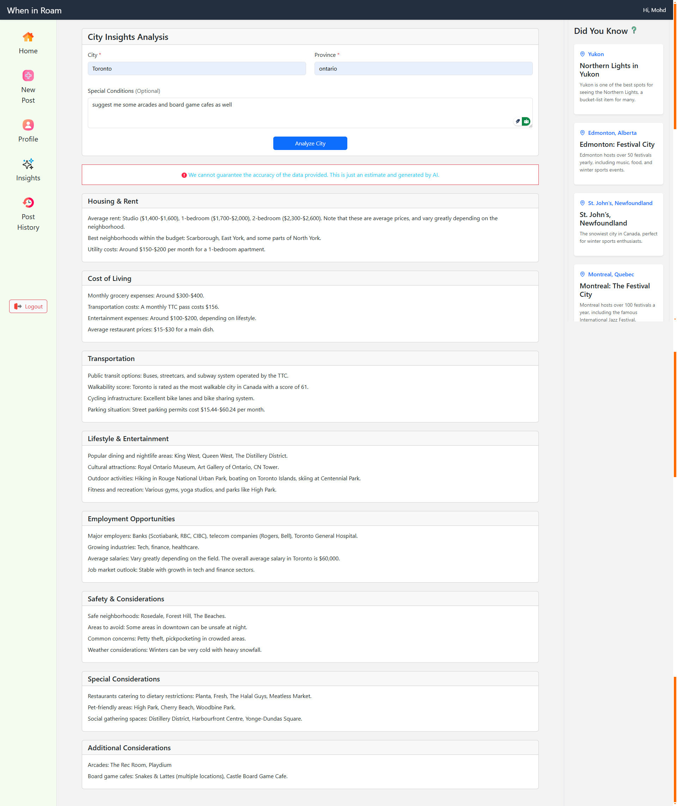
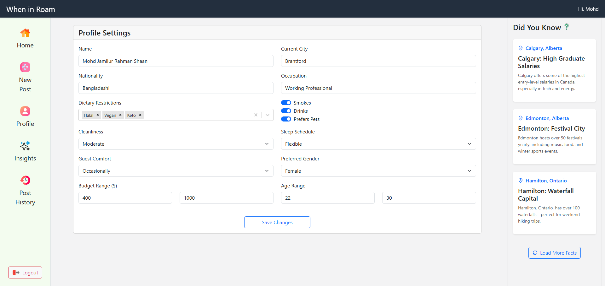

# When-in-Roam 🏠

A modern roommate-finding application that helps people transitioning to new cities connect with potential roommates. Think Tinder, but for finding your perfect roommate match!

## Features ✨

### Core Functionality
- **Profile Management**: Create and customize your profile with roommate preferences and lifestyle choices
- **Post Management**: Create, read, and delete roommate-seeking posts
- **Real-time Timestamps**: Track post freshness with dynamic timestamps (e.g., "4 mins ago", "1 day ago")
- **Direct Email Connection**: Instantly connect with potential roommates through integrated email functionality
- **Fully Responsive**: Seamless experience across desktop and mobile devices
- **AI Powered:** Leverage the powerful AI model working behind the scenes to provide you the up-to-date recommendations on the city of your choice

### AI-Powered City Insights 🌆
Get personalized city information through our AI feature, providing curated insights about:
- Housing and Rent Trends
- Transportation Options
- Nightlife Scene
- Safety Statistics
- Entertainment Options
- Cost of Living Analysis

## Live Demo 🌐
[Live Demo Link](https://when-in-roam-79b74212d770.herokuapp.com)

## Tech Stack 💻

### Frontend
- React (Vite)
- Bootstrap
- Firebase Authentication
- Axios

### Backend
- Node.js
- Express
- MongoDB
- SendGrid (Email Service)
- OpenAI GPT-4o Integration

## Screenshots 📸
<table>
  <tr>
    <td>
      
      <em>Home Page</em>
    </td>
    <td>
      
      <em>AI City Insights</em>
    </td>
  </tr>
  <tr>
    <td>
      
      <em>Profile View</em>
    </td>
  </tr>
</table>

## Prerequisites 📋

- Node.js >= 18.0.0
- MongoDB
- Various API Keys (see Environment Variables section)

## Environment Variables 🔑

Create a `.env` file in the root directories of backend and frontend folders with the following variables:

```env
# MongoDB
MONGODB_URI=your_mongodb_uri

# Firebase
FIREBASE_API_KEY=your_firebase_api_key
FIREBASE_AUTH_DOMAIN=your_auth_domain
FIREBASE_PROJECT_ID=your_project_id
FIREBASE_STORAGE_BUCKET=your_storage_bucket
FIREBASE_MESSAGING_SENDER_ID=your_sender_id
FIREBASE_APP_ID=your_app_id

# OpenAI
OPENAI_API_KEY=your_openai_api_key

# SendGrid
SENDGRID_API_KEY=your_sendgrid_api_key
```

## Installation & Setup 🚀

1. Clone the repository
```bash
git clone https://github.com/yourusername/when-in-roam.git
cd when-in-roam
```

2. Install dependencies
```bash
# Install backend dependencies
npm install

# Install frontend dependencies
cd client
npm install
```

3. Set up environment variables
- Create a `.env` file in the root directory
- Add all required environment variables (see section above)

4. Start the development servers
```bash
# Start backend server
npm start

# In a new terminal, start frontend
cd client
npm run dev
```

## Browser Support 🌐
Tested and optimized for:
- Google Chrome
- Firefox
- Mobile browsers

## Usage 📱
1. Sign up/Login using your email
2. Complete your profile with roommate preferences
3. Create posts or browse existing ones
4. Use the powerful AI-powered City Insights feature to learn about potential cities
5. Connect with potential roommates via the email integration

## Security 🔒
- All routes require authentication
- Secure email integration through SendGrid
- Firebase authentication for user management
- Environment variables for sensitive data

## Future Enhancements 🚀
- Public post viewing without authentication
- Advanced filtering options
- In-app messaging system
- Review and rating system for users

## Contributing 🤝
Contributions are welcome! Please feel free to submit a Pull Request.

## License 📄
This project is licensed under the MIT License.

## Support 📧
For support, email [r.jamilur96@gmail.com]

## Acknowledgments 👏
- OpenAI for GPT-4o Integration
- Firebase for Authentication
- SendGrid for Email Services
- Flaticons for Icons